<!--
  SKELETON — FEATURE LEVEL. Copy into specs/<NNN>-<feature-name>/system-context.md
  (one feature = one folder). Replace every <placeholder>.

  Belongs here only if it names something only THIS feature has. A sentence
  that would read the same in another feature's file belongs in
  project-level.md instead — never re-explain a mechanism it already states,
  only use it.

  Scope is capped at C4 Level 3 (components) — data contracts, endpoints and
  DTOs (C4 Level 4) live in this feature's own API contracts + DataModels
  document, never here.

  Write "N/A — <why>" rather than deleting a section that doesn't apply.
-->

# System Context — <Feature Name>

Feature id: `<NNN>-<feature-name>` · Governed by: `<path to this project's project-level.md>` ·
Origin stories: `<US-ID-1>`, `<US-ID-2>`, …

## 1. Scope & Boundaries

### In-scope

<what this feature owns end to end>

### Explicitly out-of-scope

<what touches this feature but belongs to someone/something else — name the owner>

## 2. Component System Context (C4 Level 3)

<!-- A diagram, not prose — instantiate project-level.md §3/§4's generic
     mechanisms with this feature's actual components and edges. -->

```mermaid
C4Component
  title <Feature Name> — component context

  Container_Boundary(<id>, "<this feature's package/module>") {
    Component(<id>, "<component>", "<tech>", "<responsibility>")
  }

  Container(<id>, "<dependency>", "<tech>", "<what it provides>")

  Rel(<from>, <to>, "<what crosses this edge, and how>")
```

**Read of this diagram:** <which dependencies are sanctioned per
`project-level.md` §4, and which are new couplings this feature must justify>

## 3. Dynamic Behavior

<!-- One state machine per distinct lifecycle; built on top of the
     state-management approach project-level.md §5 fixes, never a different one. -->

```mermaid
stateDiagram-v2
  [*] --> <InitialState>
  <InitialState> --> <NextState>: <trigger>
  <NextState> --> <NextState>: <event that mutates state without changing phase>
```



<add a sequence diagram instead/alongside wherever a flow reads better than states>

## 4. QA Isolation Rules

<which tests exist for this feature, where they live, and what access an
implementing agent has to them and to their expected/golden output>
